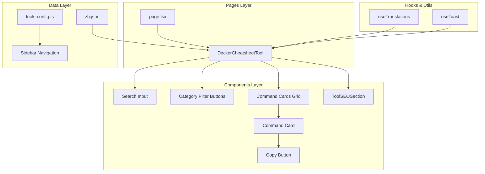

# Design Document: Docker Cheatsheet

## Overview

Docker Cheatsheet 是一个 Docker 命令速查工具，采用与现有 Git Cheatsheet 相同的架构模式。该工具提供分类浏览、搜索过滤、一键复制等功能，帮助开发者快速查找和使用 Docker 命令。

## Architecture



## Components and Interfaces

### 1. Page Component (`page.tsx`)

位置: `src/app/[locale]/tools/docker-cheatsheet/page.tsx`

```typescript
interface PageProps {
  params: Promise<{
    locale: string
  }>
}

// 生成页面元数据
export async function generateMetadata({ params }: PageProps): Promise<Metadata>

// 渲染 DockerCheatsheetTool 组件
export default function DockerCheatsheetPage()
```

### 2. Layout Component (`layout.tsx`)

位置: `src/app/[locale]/tools/docker-cheatsheet/layout.tsx`

```typescript
// 简单的布局包装器，传递 children
export default function DockerCheatsheetLayout({ children })
```

### 3. Main Tool Component (`docker-cheatsheet-tool.tsx`)

位置: `src/components/tools/docker-cheatsheet/docker-cheatsheet-tool.tsx`

```typescript
interface Command {
  cmd: string    // Docker 命令
  desc: string   // 命令描述
}

interface CommandCategory {
  [key: string]: Command
}

interface AllCommands {
  [category: string]: CommandCategory
}

// 分类顺序常量
const CATEGORY_ORDER = [
  'containers',
  'images', 
  'volumes',
  'networks',
  'compose',
  'system',
  'registry',
  'build'
]

// 组件状态
interface ComponentState {
  searchQuery: string           // 搜索关键词
  activeCategory: string | null // 当前选中的分类
  copiedCommand: string | null  // 最近复制的命令
}
```

## Data Models

### Translation Data Structure (zh.json)

```json
{
  "tools": {
    "docker-cheatsheet": {
      "name": "Docker 命令速查",
      "description": "快速查找和复制常用 Docker 命令",
      "search_placeholder": "搜索 Docker 命令...",
      "all_categories": "全部分类",
      "no_results": "未找到匹配的命令",
      "copy_success": "命令已复制",
      "categories": {
        "containers": "容器管理",
        "images": "镜像管理",
        "volumes": "数据卷",
        "networks": "网络管理",
        "compose": "Docker Compose",
        "system": "系统管理",
        "registry": "镜像仓库",
        "build": "镜像构建"
      },
      "commands": {
        "containers": {
          "run": { "cmd": "docker run [OPTIONS] IMAGE", "desc": "创建并启动容器" },
          "ps": { "cmd": "docker ps", "desc": "列出运行中的容器" },
          // ... more commands
        },
        // ... more categories
      },
      "meta": {
        "title": "Docker 命令速查 - IT Tools",
        "description": "...",
        "keywords": "..."
      }
    }
  }
}
```

### Tools Config Entry

```typescript
{
  id: "docker-cheatsheet",
  nameKey: "tools.docker-cheatsheet.name",
  descriptionKey: "tools.docker-cheatsheet.description",
  category: "docker",
  path: "/tools/docker-cheatsheet",
  icon: "terminal"
}
```

## Correctness Properties

*A property is a characteristic or behavior that should hold true across all valid executions of a system-essentially, a formal statement about what the system should do. Properties serve as the bridge between human-readable specifications and machine-verifiable correctness guarantees.*

### Property 1: Category Filter Correctness

*For any* category selection, all displayed commands should belong to that selected category.

**Validates: Requirements 1.2**

### Property 2: Category Count Accuracy

*For any* category, the displayed count in the category card header should equal the actual number of commands in that category.

**Validates: Requirements 1.4**

### Property 3: Search Filter Correctness

*For any* search query, all displayed commands should contain the query string in either the command text or description.

**Validates: Requirements 2.1**

### Property 4: Case-Insensitive Search

*For any* search query, searching with uppercase, lowercase, or mixed case should return the same results.

**Validates: Requirements 2.2**

### Property 5: Search Count Accuracy

*For any* search query, the displayed total count should equal the actual number of filtered commands.

**Validates: Requirements 2.4**

## Error Handling

| Error Scenario | Handling Strategy |
|----------------|-------------------|
| Clipboard API not available | Display error toast with "复制失败" message |
| Translation data missing | Return empty object, display no commands |
| Invalid search input | Treat as empty search, show all commands |

## Testing Strategy

### Unit Tests

- 验证组件正确渲染所有分类
- 验证搜索过滤逻辑
- 验证分类过滤逻辑
- 验证复制功能的 UI 状态变化

### Property-Based Tests

使用 fast-check 库进行属性测试：

1. **Property 1**: 生成随机分类选择，验证过滤结果只包含该分类的命令
2. **Property 2**: 对每个分类，验证显示的计数与实际命令数量一致
3. **Property 3**: 生成随机搜索字符串，验证所有结果都包含该字符串
4. **Property 4**: 生成随机搜索字符串，验证大小写变体返回相同结果
5. **Property 5**: 生成随机搜索字符串，验证显示计数与实际过滤结果数量一致

### Test Configuration

- 使用 Vitest 作为测试框架
- 使用 fast-check 进行属性测试
- 每个属性测试运行至少 100 次迭代
- 测试文件位置: `src/components/tools/docker-cheatsheet/__tests__/`
