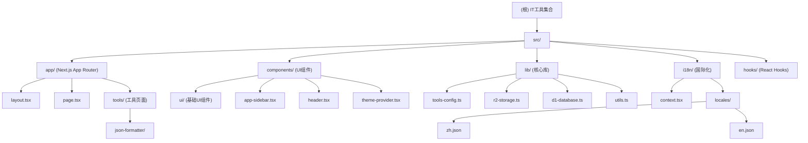

# IT工具集合 - 项目架构文档

## 变更记录 (Changelog)

### 2025-09-07 19:36:52 - 初始化架构文档
- 完成项目架构扫描与分析
- 生成项目结构文档
- 识别核心模块与依赖关系

---

## 项目愿景

IT工具集合（it-tools-app）是一个专为开发者打造的在线工具集合平台，提供JSON格式化、文本处理、加密解密等实用工具。项目采用现代化的Web技术栈，支持多语言界面、主题切换，致力于为开发者提供便捷、安全的在线工具服务。

## 架构总览

- **技术栈**: Next.js 15.5.2 + React 19.1.0 + TypeScript + Tailwind CSS 4
- **UI框架**: shadcn/ui + Radix UI + Lucide React 图标
- **构建工具**: Next.js Turbopack + ESLint
- **样式**: Tailwind CSS + CSS Variables 主题系统
- **国际化**: 自定义 i18n 实现（中文/英文）
- **云服务**: AWS S3/Cloudflare R2 存储 + D1 数据库支持

## 模块结构图



## 模块索引

| 模块路径 | 职责描述 | 入口文件 | 状态 |
|---------|---------|---------|------|
| `src/app/` | Next.js App Router 应用结构 | `layout.tsx`, `page.tsx` | ✅ 完整 |
| `src/components/` | React 组件库 | `app-sidebar.tsx`, `header.tsx` | ✅ 完整 |
| `src/lib/` | 核心工具库与配置 | `tools-config.ts`, `utils.ts` | ✅ 完整 |
| `src/i18n/` | 国际化系统 | `index.ts`, `context.tsx` | ✅ 完整 |
| `src/hooks/` | 自定义 React Hooks | `use-mobile.ts` | ✅ 完整 |

## 运行与开发

### 环境要求
- Node.js 20+
- pnpm/npm/yarn

### 开发命令
```bash
# 安装依赖
npm install

# 启动开发服务器 (使用 Turbopack)
npm run dev

# 构建生产版本
npm run build

# 启动生产服务器
npm start

# 代码检查
npm run lint
```

### 开发服务器
- 本地开发: http://localhost:3000
- 支持 Turbopack 热重载
- 自动字体优化 (Geist Sans & Mono)

## 测试策略

### 当前状态
- ❌ 缺少单元测试框架
- ❌ 缺少集成测试
- ❌ 缺少E2E测试
- ✅ ESLint 静态代码检查已配置

### 推荐测试方案
- **单元测试**: Jest + React Testing Library
- **组件测试**: Storybook
- **E2E测试**: Playwright
- **性能测试**: Lighthouse CI

## 编码规范

### TypeScript 配置
- 严格模式启用 (`strict: true`)
- ES2017 目标兼容性
- 路径别名: `@/*` → `./src/*`
- ESM 模块解析

### ESLint 规则
- Next.js 推荐配置
- TypeScript 支持
- 忽略构建输出目录

### 样式规范
- Tailwind CSS 工具类优先
- CSS Variables 主题系统
- shadcn/ui 组件设计系统
- 响应式设计原则

## AI 使用指引

### 项目特点
- 现代化 Next.js 应用架构
- 组件化开发模式
- 类型安全的 TypeScript 实现
- 国际化支持

### 开发建议
1. **新增工具**: 在 `src/lib/tools-config.ts` 配置，在 `src/app/tools/` 创建页面
2. **UI组件**: 优先使用 shadcn/ui 组件，需要时扩展 `src/components/ui/`
3. **国际化**: 在 `src/i18n/locales/` 添加翻译文本
4. **样式开发**: 使用 Tailwind CSS 类，遵循设计系统
5. **状态管理**: 目前使用 React Context，复杂状态可考虑 Zustand

### 注意事项
- 所有组件需要 TypeScript 类型定义
- 遵循 Next.js App Router 约定
- 保持组件的可访问性 (a11y)
- 工具功能优先客户端实现，保护用户隐私

---

*最后更新: 2025-09-07 19:36:52*