# IT工具集合 - 项目架构文档

## 变更记录 (Changelog)

### 2025-09-07 22:58:58 - 国际化架构升级与文档更新
- ✨ 升级到 next-intl 4.3.6，支持更完善的国际化功能
- 🔄 重构路由结构为 `[locale]` 动态路由模式
- 🌐 新增 Hindi 语言支持 (zh/en/hi)
- 📱 优化中间件配置，支持无前缀路径和语言路径
- 🎯 完善工具配置系统，当前有 2 个可用工具
- 📊 更新架构文档和模块结构图

### 2025-09-07 19:36:52 - 初始化架构文档
- 完成项目架构扫描与分析
- 生成项目结构文档
- 识别核心模块与依赖关系

---

## 项目愿景

IT工具集合（it-tools-app）是一个专为开发者打造的在线工具集合平台，提供JSON格式化、文本处理、加密解密等实用工具。项目采用现代化的Web技术栈，支持多语言界面、主题切换，致力于为开发者提供便捷、安全的在线工具服务。

## 架构总览

- **技术栈**: Next.js 15.5.2 + React 19.1.0 + TypeScript + Tailwind CSS 4
- **UI框架**: shadcn/ui + Radix UI + Lucide React 图标
- **构建工具**: Next.js Turbopack + ESLint + PostCSS
- **样式**: Tailwind CSS 4 + CSS Variables 主题系统
- **国际化**: next-intl 4.3.6（中文/英文/Hindi）
- **状态管理**: React Context + useState
- **云服务**: AWS S3/Cloudflare R2 存储 + D1 数据库支持

## 模块结构图

```mermaid
graph TD
    A["(根) IT工具集合"] --> B["src/"];
    B --> C["app/ (Next.js App Router)"];
    B --> D["components/ (UI组件)"];
    B --> E["lib/ (核心库)"];
    B --> F["i18n/ (国际化)"];
    B --> G["hooks/ (React Hooks)"];
    
    C --> H["layout.tsx (根布局)"];
    C --> I["page.tsx (旧首页)"];
    C --> J["[locale]/ (多语言路由)"];
    J --> K["page.tsx (新首页)"];
    J --> L["tools/ (工具页面)"];
    L --> M["json-formatter/"];
    L --> N["json-to-csv/"];
    
    D --> O["ui/ (基础UI组件)"];
    D --> P["app-sidebar.tsx"];
    D --> Q["header.tsx"];
    D --> R["theme-provider.tsx"];
    D --> S["tool-container.tsx"];
    
    E --> T["tools-config.ts"];
    E --> U["utils.ts"];
    E --> V["r2-storage.ts"];
    E --> W["d1-database.ts"];
    
    F --> X["config.ts (语言配置)"];
    F --> Y["routing.ts (路由配置)"];
    F --> Z["navigation.ts (导航)"];
    F --> AA["request.ts (服务端)"];
    F --> BB["messages/"];
    BB --> CC["zh.json"];
    BB --> DD["en.json"];
    
    G --> EE["use-mobile.ts"];

    click C "./src/app/CLAUDE.md" "查看 App Router 模块文档"
    click D "./src/components/CLAUDE.md" "查看组件模块文档"
    click E "./src/lib/CLAUDE.md" "查看核心库模块文档"
    click F "./src/i18n/CLAUDE.md" "查看国际化模块文档"
    click G "./src/hooks/CLAUDE.md" "查看 Hooks 模块文档"
```



## 模块索引

| 模块路径 | 职责描述 | 入口文件 | 关键特性 | 状态 |
|---------|---------|---------|---------|------|
| `src/app/` | Next.js App Router 应用结构 | `layout.tsx`, `page.tsx`, `[locale]/` | 路由管理、布局系统 | ✅ 完整 |
| `src/components/` | React 组件库和业务组件 | `app-sidebar.tsx`, `header.tsx` | shadcn/ui、主题切换 | ✅ 完整 |
| `src/lib/` | 核心工具库与云服务集成 | `tools-config.ts`, `utils.ts` | 工具配置、云存储 | ✅ 完整 |
| `src/i18n/` | 国际化系统 (next-intl) | `config.ts`, `routing.ts` | 多语言、路由国际化 | ✅ 完整 |
| `src/hooks/` | 自定义 React Hooks | `use-mobile.ts` | 响应式检测 | ⚠️ 基础 |

## 运行与开发

### 环境要求
- Node.js 20+
- pnpm/npm/yarn

### 开发命令
```bash
# 安装依赖
npm install

# 启动开发服务器 (使用 Turbopack)
npm run dev

# 构建生产版本 (使用 Turbopack)
npm run build

# 启动生产服务器
npm start

# 代码检查
npm run lint
```

### 开发服务器
- 本地开发: http://localhost:3000
- 支持 Turbopack 热重载
- 自动字体优化 (Geist Sans & Mono)
- 多语言路由: `/zh/tools/...`, `/en/tools/...`, `/hi/tools/...`

## 测试策略

### 当前状态
- ❌ 缺少单元测试框架
- ❌ 缺少集成测试
- ❌ 缺少国际化测试
- ❌ 缺少E2E测试
- ✅ ESLint 静态代码检查已配置
- ✅ TypeScript 严格模式启用

### 推荐测试方案
- **单元测试**: Jest + React Testing Library
- **组件测试**: Storybook + Chromatic
- **国际化测试**: next-intl 测试工具
- **E2E测试**: Playwright
- **性能测试**: Lighthouse CI
- **可访问性**: axe-core + jest-axe

## 编码规范

### TypeScript 配置
- 严格模式启用 (`strict: true`)
- ES2017 目标兼容性
- 路径别名: `@/*` → `./src/*`
- ESM 模块解析
- Next.js 插件集成

### ESLint 规则
- Next.js 15 推荐配置
- TypeScript 支持
- React Hooks 规则
- Import 排序规则

### 样式规范
- Tailwind CSS 4 工具类优先
- CSS Variables 主题系统 (light/dark/system)
- shadcn/ui 组件设计系统
- 响应式设计原则 (mobile-first)
- 可访问性 (a11y) 标准

### 国际化规范
- 使用嵌套键结构: `tools.json-formatter.name`
- 支持插值: `{count} 个工具`
- 路径本地化: `/zh/tools/`, `/en/tools/`
- 默认语言: English (en)

## AI 使用指引

### 项目特点
- 现代化 Next.js 15 应用架构
- 完整的国际化支持 (next-intl)
- 组件化开发模式
- 类型安全的 TypeScript 实现
- 客户端工具优先，保护隐私

### 开发建议
1. **新增工具**: 
   - 在 `src/lib/tools-config.ts` 配置工具信息
   - 在 `src/app/[locale]/tools/` 创建工具页面
   - 在 `src/i18n/messages/` 添加翻译文本
   
2. **UI组件**: 
   - 优先使用 shadcn/ui 组件
   - 扩展组件放在 `src/components/ui/`
   - 业务组件放在 `src/components/`

3. **国际化**:
   - 所有用户界面文字必须使用 `useTranslations()`
   - 在所有语言文件中同步添加翻译键
   - 注意语言切换的路由处理

4. **样式开发**:
   - 使用 Tailwind CSS 4 语法
   - 遵循 shadcn/ui 设计系统
   - 优先考虑暗色主题兼容性

5. **状态管理**: 
   - 简单状态使用 useState
   - 跨组件状态使用 React Context
   - 复杂状态可考虑 Zustand

### 注意事项
- 所有组件需要 TypeScript 类型定义
- 遵循 Next.js App Router 约定
- 保持组件的可访问性 (a11y)
- 工具功能优先客户端实现
- 确保多语言路由正确配置
- 使用 `next-intl` 的 API 进行国际化

### 工具开发模式
参考现有工具 (`json-formatter`, `json-to-csv`) 的实现模式：
- 客户端组件 (`"use client"`)
- 双栏布局 (输入/输出)
- 错误处理和验证
- 复制/下载功能
- 响应式设计
- 完整的国际化支持

---

*最后更新: 2025-09-07 22:58:58*